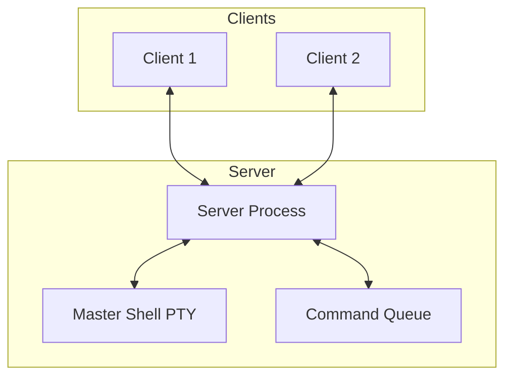

# Neptune Architecture

Neptune is a collaborative terminal-based notebook that allows multiple users to share a single shell session. It follows a client-server architecture using Unix Domain Sockets for communication.

## System Overview

### Server-Side Components
- **Server:** Manages client connections, broadcasts updates, and maintains the global state of the notebook (list of blocks, locks, etc.).
- **Master Shell:** A single persistent shell process (bash) running in a PTY. All command blocks are executed in this shell, allowing environment variables and the working directory to persist across blocks.
- **Command Queue:** Ensures that commands are executed sequentially and broadcasts queue positions to clients.

### Client-Side Components
- **ClientApp:** A Textual-based TUI application.
- **Modal Interaction:** Supports different modes (NORMAL, BASH, CMD, NOTE, SELECTION, BLOCKEDIT, CONTROL) for a Vim-like experience.
- **Terminal Emulation:** Uses `pyte` to render ANSI output from the server-side PTY within the TUI widgets.

## Communication Protocol
Communication happens over a Unix Domain Socket (default: `/tmp/neptune.sock`) using newline-delimited JSON messages.

### Message Types
- **Init/Update:** `init`, `new_block`, `update_block`, `reorder`, `remove_block`.
- **Interactivity:** `output`, `terminal_input`, `terminal_resize`, `terminal_set_echo`.
- **Collaboration:** `lock`, `unlock`, `user_join`, `user_leave`.
- **Actions:** `submit`, `edit_start`, `edit_save`, `move_block`, `run_block`.

## State Persistence
Unlike a standard Jupyter notebook that uses separate kernels, Neptune uses a single live shell. This means:
- `cd /tmp` in one block affects all subsequent blocks.
- `export VAR=val` persists across the session.
- Long-running background processes started in the shell remain active.
